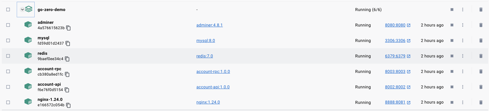
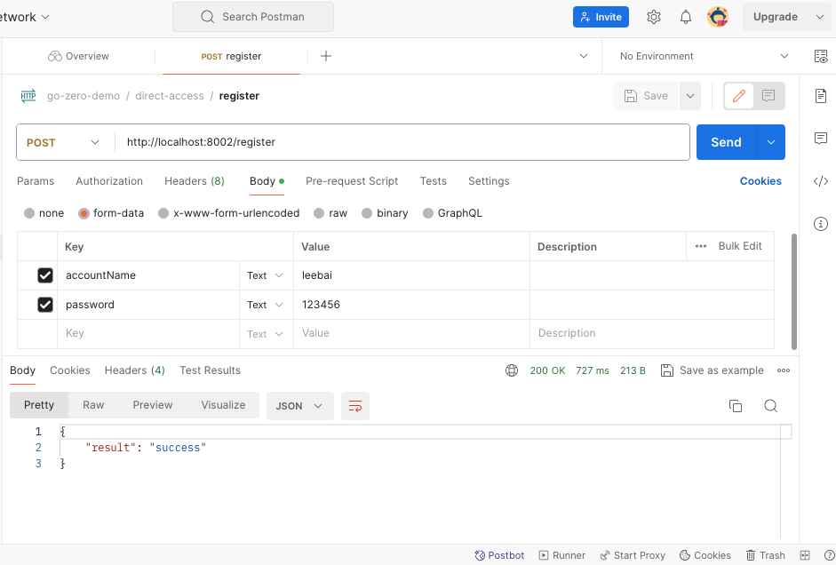

# go-zero-demo
## 快速开始
1. 构建`account-api:1.0.0`镜像
```shell
docker build -f account-api.Dockerfile -t account-api:1.0.0 .
```
2. 构建`account-rpc:1.0.0`镜像
```shell
docker build -f account-rpc.Dockerfile -t account-rpc:1.0.0 .
```
3. 进入`docker-env`目录，拉取镜像，并启动项目
```shell
docker-compose -p go-zero-demo up -d
```
4. 启动后，`docker`各容器的运行结果如下所示：

5. 使用注册接口进行简单测试,测试结果通过
