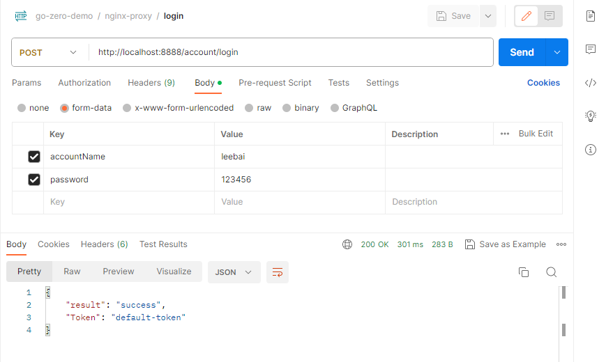
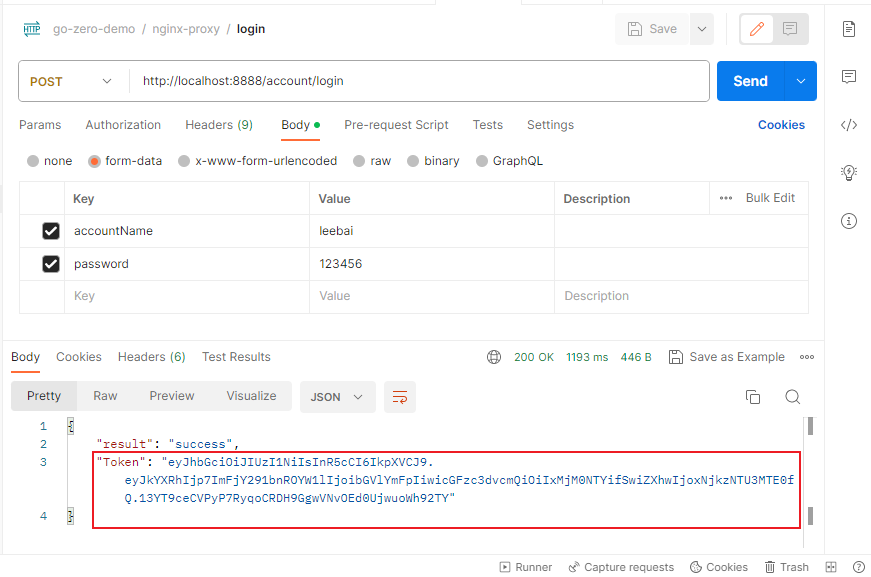

# 网关统一授权验证之登录请求
## 基本过程
这里简化一下授权验证的逻辑
1. 已经注册的用户访问`account`服务进行登录
2. 登录成功，`account`服务会返回给该用户一个token
3. 用户后续的请求都需要使用该token进行验证是否是合法请求
4. 验证通过才允许访问其他服务

登录请求的实现参照文档`02-add-new-request-api-tutorial.md`。

完成源码编写后，运行脚本`re-docker-compose.bat`，重新制作`account`镜像，并部署到`docker`环境启动即可。`re-docker-compose.bat`脚本的内容如下所示：
```bat
call build-account.Dockerfile.bat
cd ./docker-env
call run-docker-compose.bat
```

在`postman`中构造`/login`请求，最终测试结果如下所示


## jwt token生成
