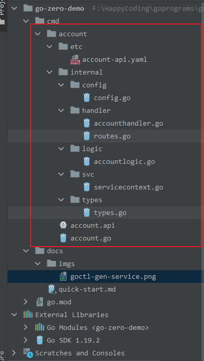

# go-zero-demo quick start
## 环境准备
1. goland新建项目，取名`go-zero-demo`
2. `go-zero-demo`同级目录创建目录`go-zero-demo-gopath`, 设置`GOPATH`为`go-zero-demo-gopath`
3. `go-zero-demo`下创建`cmd`目录，放置服务源码,`cmd`下以服务名称建立各文件夹，放置对应服务的源码，比如
    ```shell
    go-zero-demo
    ├── cmd
    │   ├── account （账号服务: 负责账号管理）
    │   │   └── main.go
    │   │
    │   ├── user （用户服务: 负责用户信息管理）
    │   ├── vuepress-tutorial
    │   │   └── README.md
    │   └── config.md
    │
    ├── docs
    │   └──quick-start.md
    │
    ├── go.mod
    └── go.sum
    ```
4. 打开终端(Terminal)，输入命令`go get -u github.com/zeromicro/go-zero@latest`安装`go-zero`框架。后续微服务的开发皆基于此框架进行开发。
5. 安装`goctl`脚手架，用于一键生成代码、文档、部署 k8s yaml、dockerfile 等。
    ```
    go get -u github.com/zeromicro/go-zero/tools/goctl@latest
    ```
6. 利用`goctl`安装`grpc`相关的组件: `protoc`,`protoc-gen-go`,`protoc-gen-go-grpc`
    ```
    goctl env check --install --verbose --force
    ```
    安装成功输出
    ```
    [goctl-env]: preparing to check env

    [goctl-env]: looking up "protoc"
    [goctl-env]: "protoc" is installed

    [goctl-env]: looking up "protoc-gen-go"
    [goctl-env]: "protoc-gen-go" is installed

    [goctl-env]: looking up "protoc-gen-go-grpc"
    [goctl-env]: "protoc-gen-go-grpc" is installed

    [goctl-env]: congratulations! your goctl environment is ready!
    ```

## demo开发
1. `Terminal`进入`cmd`目录
2. 使用`goctl`生成`account`服务,命令: `goctl api new account`, 执行结果如图所示:
    
3. `go mod tidy`下载该服务所需依赖